# Django Blog Project

- Django를 이용한 기술블로그를 제작하는 프로젝트 입니다.

## 목차

[1. 목표와 기능](#1-목표와-기능)<br>
[2. 개발 환경 및 배포 URL](#2-개발-환경-및-배포-url)<br>
[3. 개발 일정](#3-프로젝트-구조와-개발-일정)<br>
[4. 데이터베이스 모델링(ERD)](#4-데이터베이스-모델링erd)<br>
[5. URL 구조](#5-url-구조)<br>
[6. UI](#6-ui)<br>
[7. 기능 요구사항 목록](#7-기능-요구사항-목록)<br>
[8. 개발하면서 느낀 점](#8-개발과정과-느낀점)<br>

## 1. 목표와 기능

### 1-1. 목표

- 장고를 사용하여 블로그 웹 어플리케이션을 개발.
- 각 사용자에 따라 글을 생성, 업데이트, 삭제할 수 있어야 한다.
- 각 글을 읽고 댓글 및 대댓글을 작성할 수 있어야 한다.
- 모바일을 위한 반응형 페이지 제작

### 1-2. 기능

- 사용자 인증 및 권한 관리
- 블로그 글 생성, 업데이트, 삭제
- 블로그 글 목록 및 상세보기
- 댓글 + 대댓글 생성 및 관리
- 글 작성시 이미지 업로드 및 관리
- 전체 글 검색, 특정 사용자의 글 검색기능

## 2. 개발 환경 및 배포 URL

배포 URL:

Python 3.11.4
Django==4.2.6
Pillow==10.1.0
django-markdown-deux==1.0.6

#### [FrontEnd]

<div>
    
    
    
    
    
</div>

#### [BackEnd]

<div>
    
    
</div>

#### [DataBase]


### 2-2. 배포 URL

https://github.com/Blood-donation-day/My_blog

## 3. 프로젝트 구조와 개발 일정

### 3.1프로젝트 구조

```
📦 My_blog
 ┣  📂accounts
 ┃  ┣ 📂migrations
 ┃  ┣ 📂__pycache__
 ┃  ┣ 📜admin.py
 ┃  ┣ 📜apps.py
 ┃  ┣ 📜forms.py
 ┃  ┣ 📜models.py
 ┃  ┣ 📜tests.py
 ┃  ┣ 📜urls.py
 ┃  ┣ 📜views.py
 ┃  ┗ 📜__init__.py
 ┣  📂blog
 ┃  ┣ 📂migrations
 ┃  ┣ 📂__pycache__
 ┃  ┣ 📜admin.py
 ┃  ┣ 📜apps.py
 ┃  ┣ 📜forms.py
 ┃  ┣ 📜models.py
 ┃  ┣ 📜tests.py
 ┃  ┣ 📜urls.py
 ┃  ┣ 📜views.py
 ┃  ┗ 📜__init__.py
 ┣  📂core
 ┃  ┣ 📂__pycache__
 ┃  ┗ 📜models.py
 ┣  📂main
 ┃  ┣ 📂__pycache__
 ┃  ┣ 📜asgi.py
 ┃  ┣ 📜settings.py
 ┃  ┣ 📜urls.py
 ┃  ┣ 📜wsgi.py
 ┃  ┗ 📜__init__.py
 ┣  📂media
 ┃  ┣ 📂accounts
 ┃  ┃ ┗ 📂profile_imgs
 ┃  ┗ 📂blog
 ┃  ┃ ┣ 📂files
 ┃  ┃ ┗ 📂images
 ┣  📂readme
 ┣  📂static
 ┃  ┣ 📂img
 ┃  ┃ ┣ 📜LOGO1.png
 ┃  ┃ ┣ 📜profile-default.jpg
 ┃  ┃ ┗ 📜PROFILE.png
 ┃  ┗ 📂js
 ┃  ┃ ┣ 📜post_create.js
 ┃  ┃ ┣ 📜post_detail.js
 ┃  ┃ ┗ 📜profile_edit.js
 ┣  📂templates
 ┃  ┣ 📂accounts
 ┃  ┃ ┣ 📜change_password.html
 ┃  ┃ ┣ 📜login.html
 ┃  ┃ ┣ 📜profile.html
 ┃  ┃ ┣ 📜profile_edit.html
 ┃  ┃ ┗ 📜signup.html
 ┃  ┣ 📂blog
 ┃  ┃ ┣ 📜my_post.html
 ┃  ┃ ┣ 📜post_create.html
 ┃  ┃ ┣ 📜post_detail.html
 ┃  ┃ ┗ 📜post_list.html
 ┃  ┣ 📜404.html
 ┃  ┗ 📜base.html
 ┣  📜db.sqlite3
 ┣  📜manage.py
 ┣  📜README.md
 ┗  📜requirements.txt
```

### 3.2 개발 일정

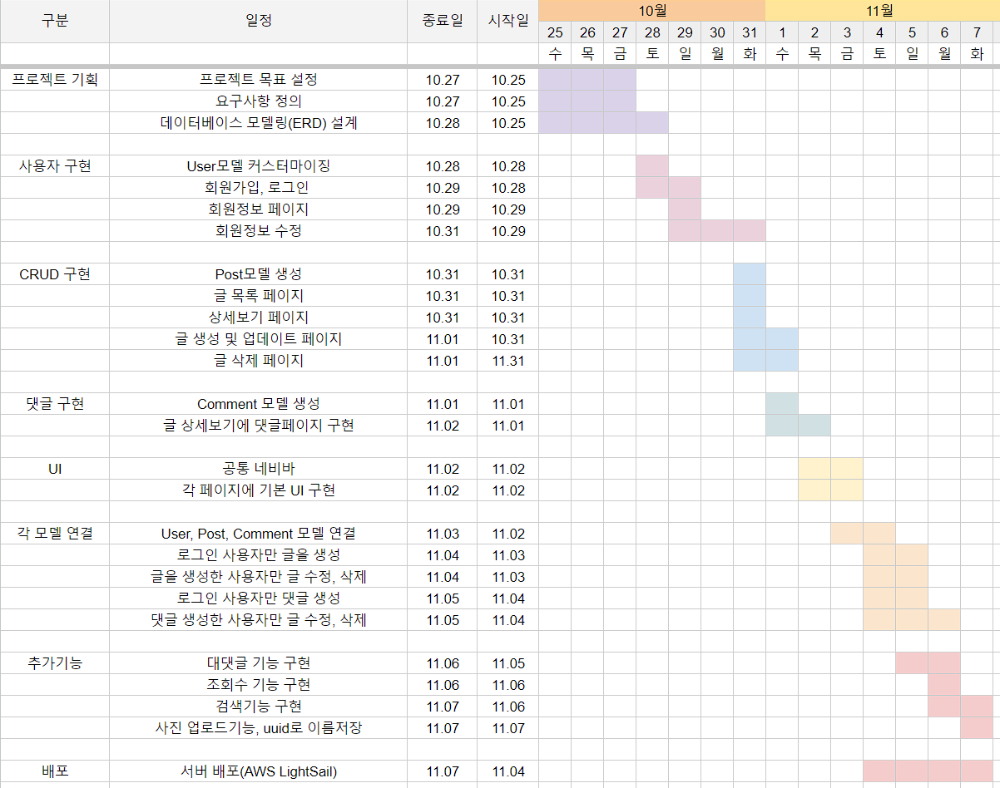

## 4. 데이터베이스 모델링(ERD)

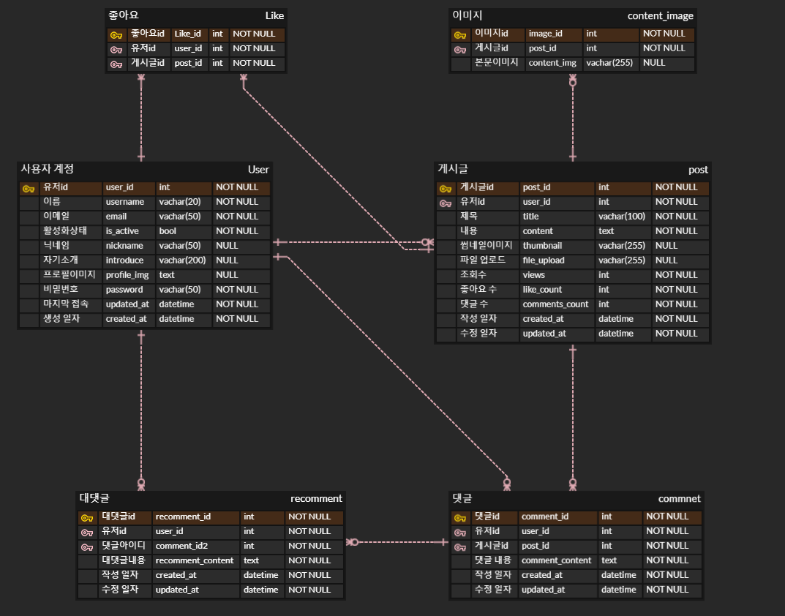
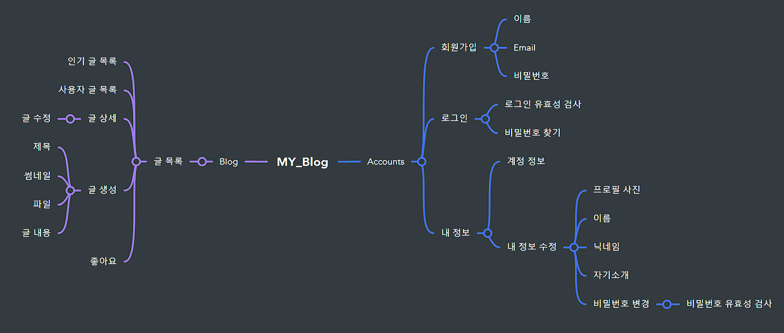

## 5. URL 구조

|    `account`    |      name       |                URL                 | 비고 |
| :-------------: | :-------------: | :--------------------------------: | ---- |
|   `회원가입`    |     Signup      |         `accounts/signup/`         |      |
|    `로그인`     |    UserLogin    |         `accounts/login/`          |      |
|   `로그아웃`    |   UserLogout    |         `accounts/logout`          |      |
|    `내 정보`    |   UserProfile   |         `accounts/profile`         |      |
| `회원정보 변경` |   UserUpdate    |         `accounts/update/`         |      |
| `비밀번호 변경` | Change_Password | `accounts/update/change_password/` |      |

|      `blog`      |     name     |           URL           | 비고 |
| :--------------: | :----------: | :---------------------: | ---- |
|    `글 목록`     |   PostList   |         `blog/`         |      |
|    `인기 글`     | PostPopular  |     `blog/popular/`     |      |
| `사용자 글 목록` | PostListUser | `blog/user/<str:blog>`  |      |
|    `글 상세`     |  PostDetail  |     `blog/<int:pk>`     |      |
|    `글 생성`     |  PostCreate  |     `blog/create/`      |      |
|    `글 수정`     |  PostUpdate  | `blog/update/<int:pk>/` |      |
|    `글 삭제`     |  PostUpdate  | `blog/delete/<int:pk>/` |      |
|  `파일 업로드`   |  PostUpdate  |     ` blog/upload`      |      |

## 6. UI

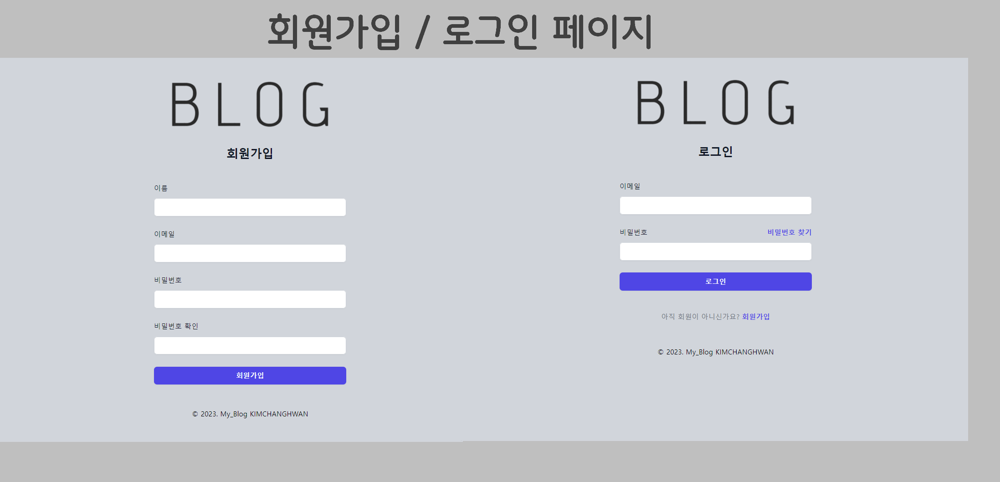
<br><br>
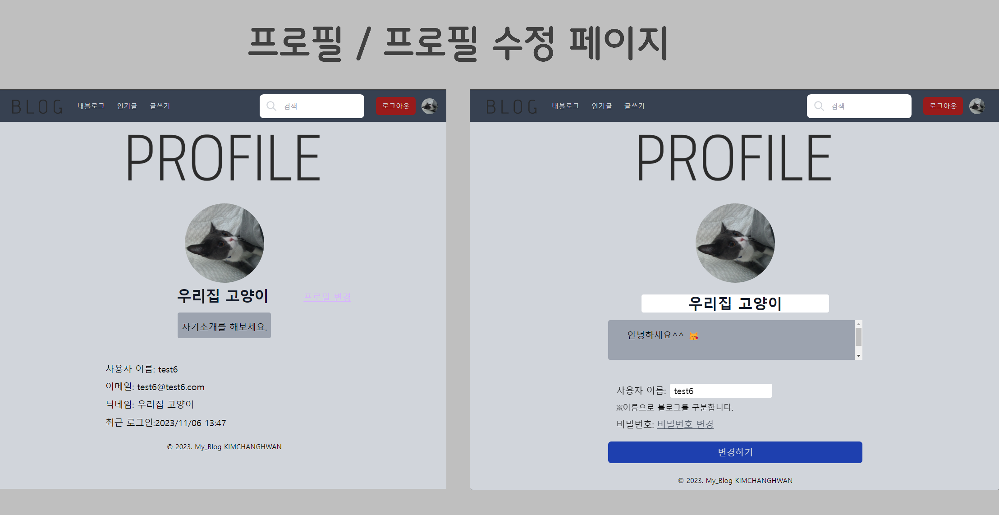
<br><br>
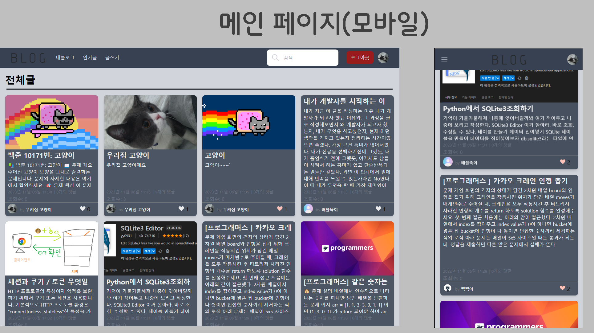
<br><br>
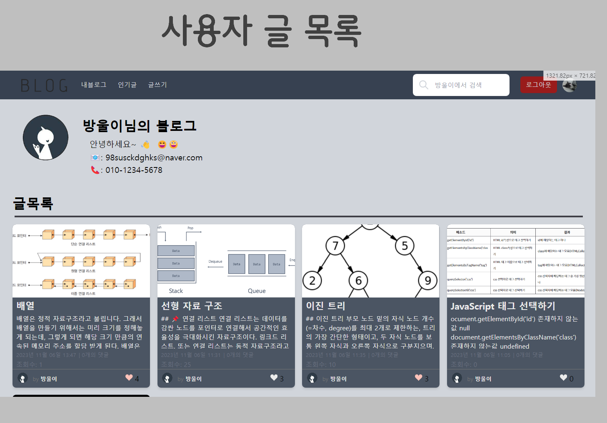
<br><br>
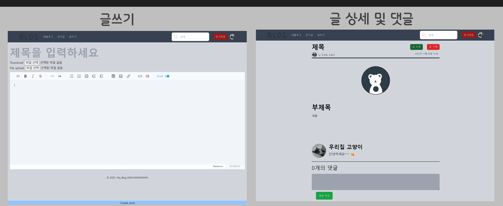
<br><br>

## 7. 기능 요구사항 목록

- 회원가입, 로그인
  <p align="center">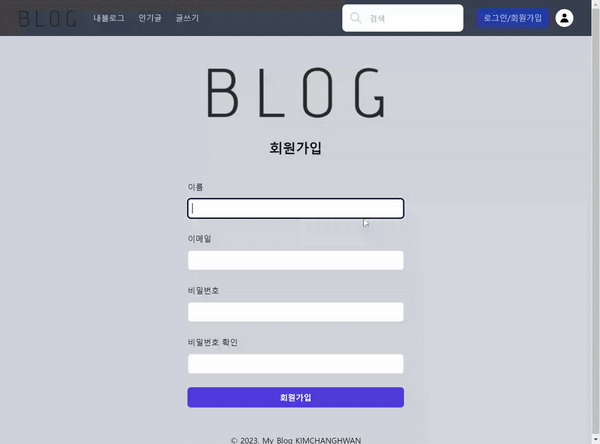
  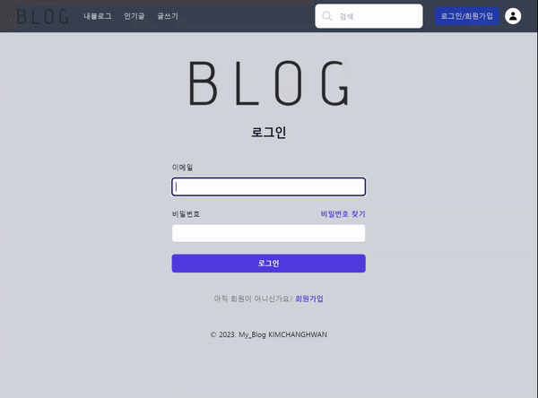</p>

- 글목록 (PC, Mobile)
<p align="center">
  </p>

- 프로필 변경
  <p align="center">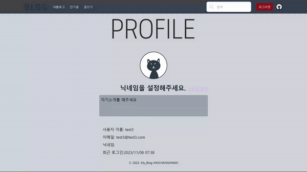
- 글 쓰기, 글 수정
   <p align="center">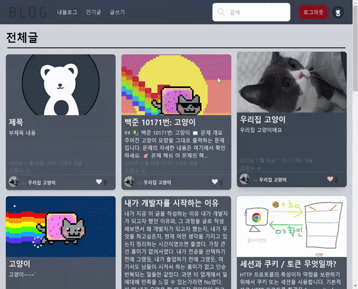
   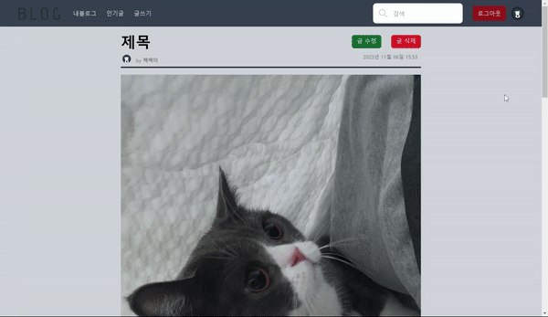
   </p>
  사진을 드래그하거나 직접 선택해 업로드 할 수 있습니다.

- 댓글, 대댓글
   <p align="center">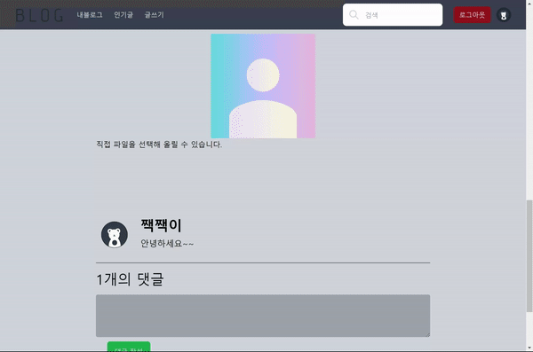

- 사용자 글 검색 (PC, Mobile)

<p align="center">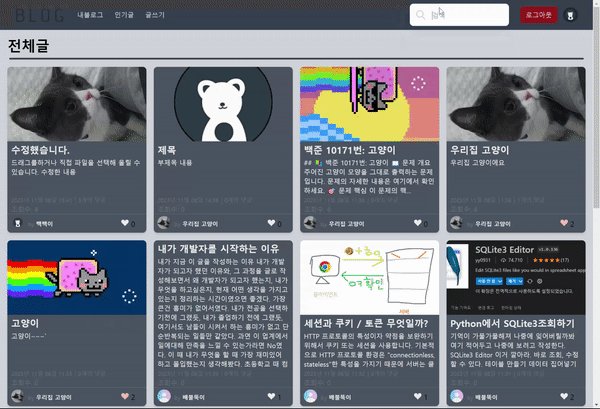
  </p>

## 8. 개발과정과 느낀점

#### Toast UI Editor 이미지 업로드

글을 생성하는 페이지에서 사용 할 에디터로 <a href="https://ui.toast.com/">Toast UI Editor</a>를 선택했습니다.
공식 <a href="https://github.com/nhn/tui.editor/tree/master/docs/ko">한글 문서</a>가 제공되며, UI가 깔끔해 해당 프로젝트에 적절하다고 판단했습니다.

기본적으로 해당 에디터는 이미지 업로드 기능을 제공하고 있습니다.

<p align="center">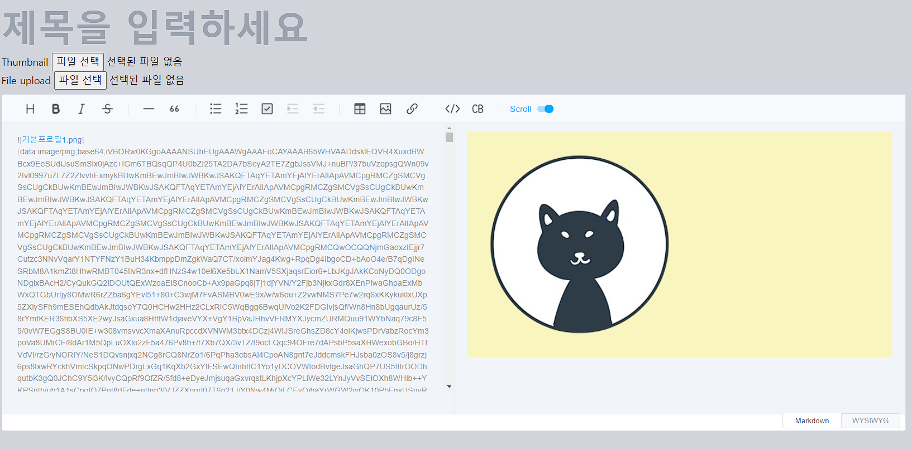
그러나, 기본 설정에서 이미지를 업로드하면 base64 형식으로 인코딩되어 출력됩니다.

360x360 사진에서 75772자가 나오고 있오고 있습니다. 글을 작성하는데 불편함이 생기며
이 글자를 그대로 db에 저장하기에 부담스럽습니다. 그래서 옵션 중 `addImageBlobHook` 속성을 이용해 이미지를 업로드하였습니다.

<p align="center">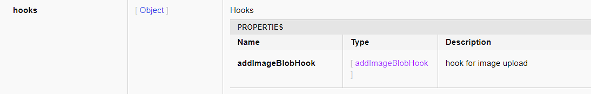

`addImageBlobHook`은 에디터에 업로드된 이미지를 Markdown 콘텐츠에 삽입되기 전에 수정할 수 있습니다.

이미지를 잠시 가져가 특정 형식으로 변환하거나 크기를 조정할 수 있습니다.

```javascript
const csrftoken = document.querySelector('[name="csrfmiddlewaretoken"]').value;

// Editor 구현
const editor = new toastui.Editor({
  el: document.querySelector("#contents"),
  height: "550px",
  initialEditType: "markdown",
  previewStyle: "vertical",
  hooks: {
    addImageBlobHook: (blob, callback) => uploadImages(blob, callback), //addImageBlobHook >> uploadImages
  },
});

// XMLHttpRequest 요청 보내기
const uploadImages = (blob, callback) => {
  let xhr = new XMLHttpRequest();

  // 이미지, csrf토큰을 가지고 /blog/upload로 POST요청
  xhr.open("POST", "/blog/upload", true); // 비동기 처리
  xhr.setRequestHeader("X-CSRFToken", csrftoken);

  const formData = new FormData();
  formData.append("images", blob);

  xhr.send(formData);

  // 받은 imageURL을 이미지의 src로 사용
  xhr.onload = function () {
    if (xhr.status === 200) {
      const imageUrl = JSON.parse(xhr.responseText).url;
      callback(imageUrl);
    } else {
      callback(
        alert("이미지 업로드에 실패하였습니다. 다음에 다시 시도해주세요.")
      );
    }
  };
};
```

클라이언트에서 XMLHttpRequest요청을 csrftoken과 이미지를 포함해 서버(`/blog/upload`)로 보냅니다.

```python
def fileUpload(request):
    if request.method == 'POST' or request.method == 'GET':
        # 업로드된 파일을 가져옵니다.
        uploaded_file = request.FILES.get('images')
        uuid = str(uuid4())
        if uploaded_file:
            # 파일 확장자를 추출합니다 (xxx.png)
            file_extension = uploaded_file.name.split('.')[-1]

            # 파일을 저장합니다. (---uuid----.png)
            file_name = os.path.join(
                'media/blog/images/', f'{uuid}.{file_extension}')
            with open(file_name, 'wb') as f:
                for chunk in uploaded_file.chunks():
                    f.write(chunk)
            print(file_name)
            # 파일의 URL을 생성합니다. (---uuid----.png)
            file_url = settings.MEDIA_URL + os.path.join(
                'blog/images/', f'{uuid}.{file_extension}')
            print(file_url)
            return JsonResponse({
                'success': True,
                'url': file_url,
            })
        else:
            return JsonResponse({
                'success': False,
                'error': '이미지를 찾을 수 없습니다.',
            })
    else:
        return JsonResponse({
            'success': False,
            'error': '비정상적인 접근입니다.',
        })
```

서버에서 요청을 받으면, 확장자 뽑아 파일이름을 uuid.확장자명으로 변경합니다.
다음 그 이미지의 URL을 만들어 클라이언트에 전달해줍니다.

uuid로 이름을 변경하는 이유는, 이름을 변경하지 않고 올렸을 때, 만약 이름이 같은 이미지가 올라온다면
새로운 이미지가 업로드되지 않고 기존 이미지만 남게됩니다. 그래서 이름을 uuid로 바꿔서 전달해주고 있습니다.

<p align="center">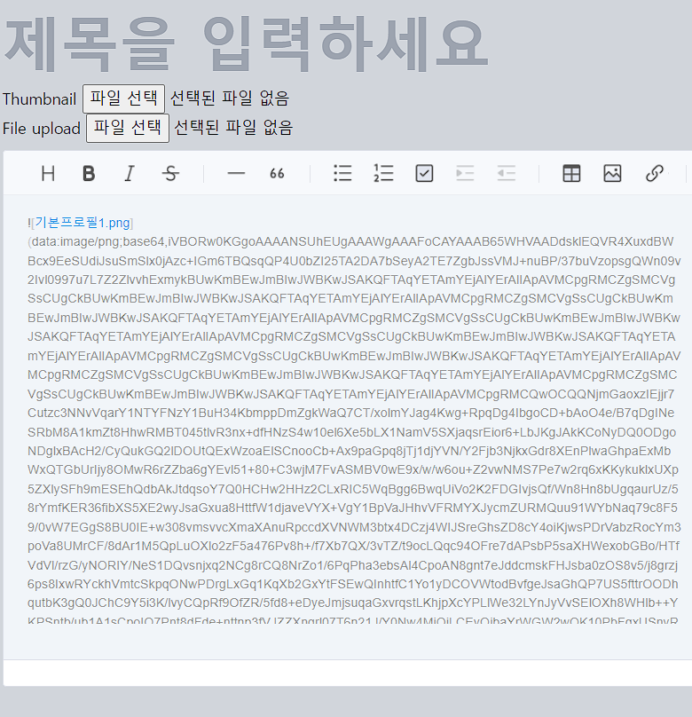
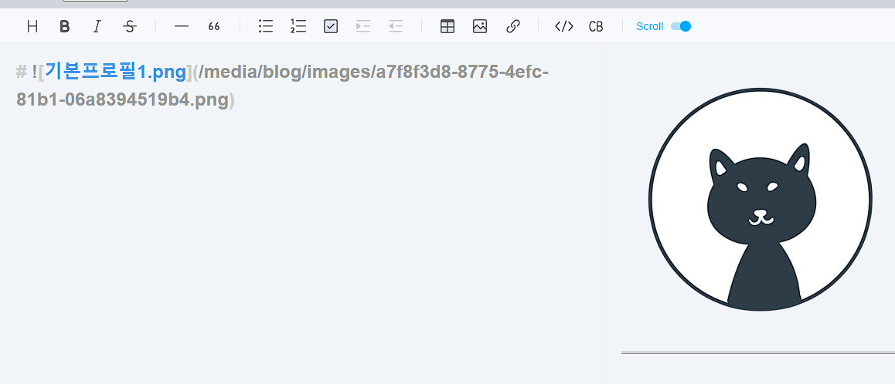
</p>
<p align="center">이미지를 업로드 했을 때 전/후</p>

그러나 아직 모든 문제가 해결되진 않았습니다.

글 목록을 조회하면 이미지의 경로가 그대로 나와 글을 읽는데 문제가 완전히 해결되지 않았습니다.
그래서 정규표현식을 사용해 글목록에서 마크다운형식의 이미지를 제거했습니다.

```html
<div
  class="post_detail text-[#ECECEC] pt-1 text-sm overflow-hidden h-[5rem15rem]"
>
  
  <p class="post_detail_text" id="post_detail_text_{{ post.pk }}">
    {{ post.content | truncatechars:100 }}
  </p>
  
  <p class="post_detail_text" id="post_detail_text_{{ post.pk }}">
    {{ post.content | truncatechars:250 }}
  </p>
  
  <script>
    // 이미지 태그를 제거하는 함수.
    function removeImageTags(text, postId) {
        // 이미지 태그를 제거하는 정규 표현식.
        const regex = /(!\[[^\]]*\]\([^\)]*\)|#)/g;
        const cleanedText = text.replace(regex, '');
        document.getElementById(`post_detail_text_${postId}`).textContent = cleanedText;  // 업데이트된 텍스트로 대체
    }
    removeImageTags(`{{ post.content|safe }}`, {{ post.pk }});
  </script>
</div>
```

썸네일이 있으면 100자, 없으면 250자까지 글 목록에서 볼 수 있고 각 포스트마다 id= "post*detail_text*{{ post.pk }}" 를 가지고 있습니다.

각각의 포스트에 대해 post.pk를 뽑아 마크다운 이미지를 제거하고 있습니다.

<p align="center">
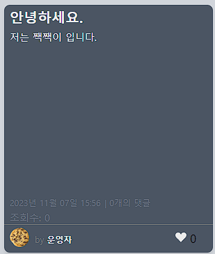
</p>

### 조회수

### 마치며

<!-- https://www.erdcloud.com/d/Nc268EwQ8d2csQMXe


404 403 페이지

(대댓글) 좋아요

페이지네이션

검색과 페이지네이션


이미지나 파일을 저장할때 uuid로 바꿔서 저장
조회수: {{ post.views | add:-1 }}

    def form_valid(self, form):
        form.instance.author = self.request.user
        form.instance.views -= 1
        return super().form_valid(form)

uieditor 적용부분
script파일 나누기

이미지를 저장하는 부분
 if uploaded_file:
            # 파일을 저장합니다.
            file_name = os.path.join('media/blog/images/', uploaded_file.name)
            with open(file_name, 'wb') as f:
                for chunk in uploaded_file.chunks():
                    f.write(chunk)

            # 파일의 URL을 생성합니다.
            file_url = settings.MEDIA_URL + file_name
이미지이름이 곂치면 기존의 이미지가나옴 >> uuid사용하여 랜덤이미지이름
favcon?

contentimage 모델 삭제
-->
