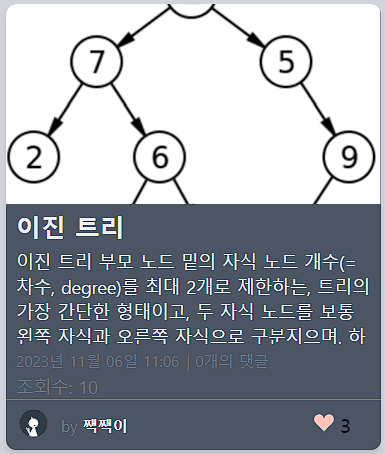
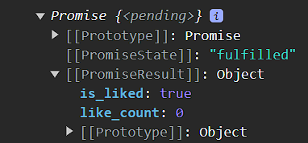
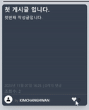

# Django Blog Project

- Django를 이용한 기술블로그를 제작하는 프로젝트 입니다.

## 목차

[1. 목표와 기능](#1-목표와-기능)<br>
[2. 개발 환경 및 배포 URL](#2-개발-환경-및-배포-url)<br>
[3. 개발 일정](#3-프로젝트-구조와-개발-일정)<br>
[4. 데이터베이스 모델링(ERD)](#4-데이터베이스-모델링erd)<br>
[5. URL 구조](#5-url-구조)<br>
[6. UI](#6-ui)<br>
[7. 기능 요구사항 목록](#7-기능-요구사항-목록)<br>
[8. 개발하면서 느낀 점](#8-개발과정과-느낀점)<br>

## 1. 목표와 기능

### 1-1. 목표

- 장고를 사용하여 블로그 웹 어플리케이션을 개발.
- 모놀리식 아키텍쳐를 가진다. (DRF는 이 프로젝트에서 사용하지 않습니다.)
- 각 사용자에 따라 글을 생성, 업데이트, 삭제할 수 있어야 한다.
- 각 글을 읽고 댓글 및 대댓글을 작성할 수 있어야 한다.
- 모바일을 위한 반응형 페이지 제작

### 1-2. 기능

- 사용자 인증 및 권한 관리
- 블로그 글 생성, 업데이트, 삭제
- 블로그 글 목록 및 상세보기
- 댓글 + 대댓글 생성 및 관리
- 글 작성시 이미지 업로드 및 관리
- 전체 글 검색, 특정 사용자의 글 검색기능

## 2. 개발 환경 및 배포 URL

#### [FrontEnd]

<div>
    
    
    
    
    
</div>

#### [BackEnd]

<div>
    
    
</div>

#### [DataBase]


### 2-2. 배포 URL

http://52.79.248.150:8000/blog/

## 3. 프로젝트 구조와 개발 일정

### 3.1프로젝트 구조

```
📦 My_blog
 ┣  📂accounts
 ┃  ┣ 📂migrations
 ┃  ┣ 📂__pycache__
 ┃  ┣ 📜admin.py
 ┃  ┣ 📜apps.py
 ┃  ┣ 📜forms.py
 ┃  ┣ 📜models.py
 ┃  ┣ 📜tests.py
 ┃  ┣ 📜urls.py
 ┃  ┣ 📜views.py
 ┃  ┗ 📜__init__.py
 ┣  📂blog
 ┃  ┣ 📂migrations
 ┃  ┣ 📂__pycache__
 ┃  ┣ 📜admin.py
 ┃  ┣ 📜apps.py
 ┃  ┣ 📜forms.py
 ┃  ┣ 📜models.py
 ┃  ┣ 📜tests.py
 ┃  ┣ 📜urls.py
 ┃  ┣ 📜views.py
 ┃  ┗ 📜__init__.py
 ┣  📂core
 ┃  ┣ 📂__pycache__
 ┃  ┗ 📜models.py
 ┣  📂main
 ┃  ┣ 📂__pycache__
 ┃  ┣ 📜asgi.py
 ┃  ┣ 📜settings.py
 ┃  ┣ 📜urls.py
 ┃  ┣ 📜wsgi.py
 ┃  ┗ 📜__init__.py
 ┣  📂media
 ┃  ┣ 📂accounts
 ┃  ┃ ┗ 📂profile_imgs
 ┃  ┗ 📂blog
 ┃  ┃ ┣ 📂files
 ┃  ┃ ┗ 📂images
 ┣  📂readme
 ┣  📂static
 ┃  ┣ 📂img
 ┃  ┃ ┣ 📜LOGO1.png
 ┃  ┃ ┣ 📜profile-default.jpg
 ┃  ┃ ┗ 📜PROFILE.png
 ┃  ┗ 📂js
 ┃  ┃ ┣ 📜post_create.js
 ┃  ┃ ┣ 📜post_detail.js
 ┃  ┃ ┗ 📜profile_edit.js
 ┣  📂templates
 ┃  ┣ 📂accounts
 ┃  ┃ ┣ 📜change_password.html
 ┃  ┃ ┣ 📜login.html
 ┃  ┃ ┣ 📜profile.html
 ┃  ┃ ┣ 📜profile_edit.html
 ┃  ┃ ┗ 📜signup.html
 ┃  ┣ 📂blog
 ┃  ┃ ┣ 📜my_post.html
 ┃  ┃ ┣ 📜post_create.html
 ┃  ┃ ┣ 📜post_detail.html
 ┃  ┃ ┗ 📜post_list.html
 ┃  ┣ 📜404.html
 ┃  ┗ 📜base.html
 ┣  📜db.sqlite3
 ┣  📜manage.py
 ┣  📜README.md
 ┗  📜requirements.txt
```

### 3.2 개발 일정


## 4. 데이터베이스 모델링(ERD)


### 공통모델

처음 데이터베이스를 설계할 떄 모든 테이블 에는 만들어진 시간과, 수정된 시간이 있었습니다.

```python
class TimestampedModel(models.Model):

    created_at = models.DateTimeField(auto_now_add=True)
    updated_at = models.DateTimeField(auto_now=True)

    class Meta:
        # 추상화 메타 클래스로 선언
        # 데이터베이스 테이블을 생성하지 않고 다른 모델에서 상속받아 사용
        abstract = True
        ordering = ['-created_at', '-updated_at']
```

모든 모델에서 `TimestampedModel`을 상속받아 사용하게하여 중복을 줄였습니다.

## 5. URL 구조

|    `account`    |      name       |                URL                 | 비고 |
| :-------------: | :-------------: | :--------------------------------: | ---- |
|   `회원가입`    |     Signup      |         `accounts/signup/`         |      |
|    `로그인`     |    UserLogin    |         `accounts/login/`          |      |
|   `로그아웃`    |   UserLogout    |         `accounts/logout`          |      |
|    `내 정보`    |   UserProfile   |         `accounts/profile`         |      |
| `회원정보 변경` |   UserUpdate    |         `accounts/update/`         |      |
| `비밀번호 변경` | Change_Password | `accounts/update/change_password/` |      |

|      `blog`      |     name     |           URL           | 비고 |
| :--------------: | :----------: | :---------------------: | ---- |
|    `글 목록`     |   PostList   |         `blog/`         |      |
|    `인기 글`     | PostPopular  |     `blog/popular/`     |      |
| `사용자 글 목록` | PostListUser | `blog/user/<str:blog>`  |      |
|    `글 상세`     |  PostDetail  |     `blog/<int:pk>`     |      |
|    `글 생성`     |  PostCreate  |     `blog/create/`      |      |
|    `글 수정`     |  PostUpdate  | `blog/update/<int:pk>/` |      |
|    `글 삭제`     |  PostUpdate  | `blog/delete/<int:pk>/` |      |
|  `파일 업로드`   |  PostUpdate  |     ` blog/upload`      |      |

## 6. UI


<br><br>

<br><br>

<br><br>

<br><br>

<br><br>

## 7. 기능 요구사항 목록

- 회원가입, 로그인
  <p align="center">
  </p>
  회원가입 시 로그인 상태로 메인페이지로 이동합니다.
<br>
- 글목록 (PC, Mobile)
   <p align="center">
    
   </p>
   브라우저 크기에 따라 반응형 웹을 구현하였습니다.
<br>
- 프로필 변경
  <p align="center"></p>
  프로필 사진을 클릭해 사진을 변경하고 닉네임, 자기소개를 설정합니다.
<br>
- 글 쓰기, 글 수정
   <p align="center">
   
   </p>
  사진을 드래그하거나 직접 선택해 업로드 할 수 있습니다.

글을 생성하는 페이지에서 사용 할 에디터로 <a href="https://ui.toast.com/">Toast UI Editor</a>를 선택했습니다.
공식 <a href="https://github.com/nhn/tui.editor/tree/master/docs/ko">한글 문서</a>가 제공되며, UI가 깔끔해 해당 프로젝트에 적절하다고 판단했습니다.
<br>

- 댓글, 대댓글
   <p align="center"></p>
  댓글과 답글을 작성할 수 있습니다.
<br>

- 사용자 글 검색 (PC, Mobile)

<p align="center">
  </p>
  전체글, 또는 각 사용자의 글에서 검색할 수 있습니다.
<br>

## 8. 개발과정과 느낀점

#### 🍞 Toast UI Editor 이미지 업로드

기본적으로 해당 에디터는 이미지 업로드 기능을 제공하고 있습니다.

<p align="center">
그러나, 기본 설정에서 이미지를 업로드하면 base64 형식으로 인코딩되어 출력됩니다.

360x360 사진에서 75772자가 나오고 있오고 있습니다. 글을 작성하는데 불편함이 생기며
이 글자를 그대로 db에 저장하기에 부담스럽습니다. 그래서 옵션 중 `addImageBlobHook` 속성을 이용해 이미지를 업로드하였습니다.

<p align="center">

`addImageBlobHook`은 에디터에 업로드된 이미지를 Markdown 콘텐츠에 삽입되기 전에 수정할 수 있습니다.

이미지를 잠시 가져가 특정 형식으로 변환하거나 크기를 조정할 수 있습니다.

```javascript
//csrf 토큰
const csrftoken = document.querySelector('[name="csrfmiddlewaretoken"]').value;
//editor 불러오기
const editor = new toastui.Editor({
  el: document.querySelector("#contents"),
  height: "550px",
  initialEditType: "markdown",
  previewStyle: "vertical",
  hooks: {
    addImageBlobHook: (blob, callback) => uploadImages(blob, callback), //addImageBlobHook >> uploadImages
  },
});
const uploadImages = (blob, callback) => {
  // 이미지, csrf토큰을 가지고 /blog/upload로 POST요청
  const url = "/blog/upload";
  // fetch 요청 보내기
  fetch(url, {
    method: "POST",
    headers: {
      "X-CSRFToken": csrftoken,
    },
    body: createFormData(blob),
  })
    .then((response) => {
      if (response.status === 200) {
        return response.json();
      } else {
        throw new Error(
          "이미지 업로드에 실패하였습니다. 다음에 다시 시도해주세요."
        );
      }
    })
    .then((data) => {
      // 받은 imageURL을 이미지의 src로 사용
      callback(data.url);
    })
    .catch((error) => {
      callback(alert(error.message));
    });
};
const createFormData = (blob) => {
  const formData = new FormData();
  formData.append("images", blob);
  return formData;
};
```

클라이언트에서 fetch요청을 csrftoken과 이미지를 포함해 서버(`/blog/upload`)로 보냅니다.

```python
def fileUpload(request):
    if request.method == 'POST' or request.method == 'GET':
        # 업로드된 파일을 가져옵니다.
        uploaded_file = request.FILES.get('images')
        uuid = str(uuid4())
        if uploaded_file:
            # 파일 확장자를 추출합니다 (xxx.png)
            file_extension = uploaded_file.name.split('.')[-1]

            # 파일을 저장합니다. (---uuid----.png)
            file_name = os.path.join(
                'media/blog/images/', f'{uuid}.{file_extension}')
            with open(file_name, 'wb') as f:
                for chunk in uploaded_file.chunks():
                    f.write(chunk)
            print(file_name)
            # 파일의 URL을 생성합니다. (---uuid----.png)
            file_url = settings.MEDIA_URL + os.path.join(
                'blog/images/', f'{uuid}.{file_extension}')
            print(file_url)
            return JsonResponse({
                'success': True,
                'url': file_url,
            })
        else:
            return JsonResponse({
                'success': False,
                'error': '이미지를 찾을 수 없습니다.',
            })
    else:
        return JsonResponse({
            'success': False,
            'error': '비정상적인 접근입니다.',
        })
```

서버에서 요청을 받으면, 확장자 뽑아 파일이름을 `uuid`.확장자명으로 변경합니다.
다음 그 이미지의 URL을 만들어 클라이언트에 전달해줍니다.

uuid로 이름을 변경하는 이유는, 이름을 변경하지 않고 올렸을 때, 만약 이름이 같은 이미지가 올라온다면 새로운 이미지가 업로드되지 않고 기존 이미지만 남게됩니다. 그래서 이름을 uuid로 바꿔서 전달해주고 있습니다.

<p align="center">

</p>
<p align="center">이미지를 업로드 했을 때 전/후</p>

그러나 아직 모든 문제가 해결되진 않았습니다.

글 목록을 조회하면 이미지의 경로가 그대로 나와 글을 읽는데 문제가 생겼습니다.
그래서 정규표현식을 사용해 글목록에서 마크다운형식의 이미지를 제거했습니다.

```html
<div
  class="post_detail text-[#ECECEC] pt-1 text-sm overflow-hidden h-[5rem15rem]"
>
  
  <p class="post_detail_text" id="post_detail_text_{{ post.pk }}">
    {{ post.content | truncatechars:100 }}
  </p>
  
  <p class="post_detail_text" id="post_detail_text_{{ post.pk }}">
    {{ post.content | truncatechars:250 }}
  </p>
  
  <script>
    // 이미지 태그를 제거하는 함수.
    function removeImageTags(text, postId) {
        // 이미지 태그를 제거하는 정규 표현식.
        const regex = /(!\[[^\]]*\]\([^\)]*\)|#)/g;
        const cleanedText = text.replace(regex, '');
        document.getElementById(`post_detail_text_${postId}`).textContent = cleanedText;  // 업데이트된 텍스트로 대체
    }
    removeImageTags(`{{ post.content|safe }}`, {{ post.pk }});
  </script>
</div>
```

썸네일이 있으면 100자, 없으면 250자까지 글 목록에서 미리 볼 수 있고 각 포스트마다 `id= "post*detail_text*{{ post.pk }}"` 를 가지고 있어 id를 찾아서 정규표현식으로 문자를 제거했습니다.

<p align="center">


</p>

<br>

### 👍좋아요

게시글 마다 좋아요기능을 구현하고자 했습니다. 한사람당 한번씩 좋아요를 누를 수 있으며
한번 클릭 시 좋아요, 좋아요 상태에서 한번 더 클릭하면 좋아요 취소를 하고싶었습니다.

또한 그 게시물에 몇명이 좋아요를 눌렀는지 표시해주고 싶었습니다.

```python
class Like(TimestampedModel):
    user = models.ForeignKey(User, on_delete=models.CASCADE)
    post = models.ForeignKey(Post, on_delete=models.CASCADE)
```

모델은 "한 게시물에" 여러 사람이 누를 수 있고, "한 사람이" 여러 게시물에 좋아요를 누를 수 있기 때문에
둘을 이어주는 중계 테이블을 만들었습니다.

"클릭"하면 좋아요 여부를 표시해 주어야 하고, 몇명이 좋아요를 눌렀는지도 알려줘야합니다.
좋아요를 누를 때마다 페이지가 새로고침 하지않고 동적으로 업데이트 해야 함으로 스크립트를 사용했습니다.

```javascript
//csrf 토큰
const csrftoken = document.querySelector(
  "input[name=csrfmiddlewaretoken]"
).value;
const likeButtons = document.querySelectorAll(".like-button");
likeButtons.forEach((button) => {
  button.addEventListener("click", function () {
    //data-post-id 값
    const postid = button.dataset.postId;
    const url = "".replace("0", postid);
    fetch(url, {
      method: "POST",
      headers: {
        "X-CSRFToken": csrftoken,
        "Content-Type": "application/json",
      },
    })
      .then((response) => {
        return response.json();
      })
      .then((data) => {
        // 업데이트된 좋아요 수를 템플릿에 반영
        const likeCountElement = document.getElementById(
          "like-count-" + postid
        );
        likeCountElement.textContent = data.like_count;

        // 좋아요 또는 좋아요 취소 버튼 토글
        if (data.is_liked) {
          button.querySelector(".like-heart").style.fill = "currentColor";
        } else {
          button.querySelector(".like-heart").style.fill =
            "rgba(255, 194, 185, 1)";
        }
      });
  });
});
```

각 글의 좋아요 버튼을 누르면 fetch 요청을 보냅니다. fetch url은 `data-post-id="{{ post.id }}` 에서 id값을 가져옵니다.

`"".replace("0", postid);` 로 url을 만들어 해당 url로 요청을 보냅니다.
요청을 보낸 후 서버에서 받은 응답에따라 좋아요 여부를 표시해줍니다.

```python
def like_post(request, pk):
    post = get_object_or_404(Post, pk=pk)

    if request.method != 'POST':
        return JsonResponse({'error': '잘못된 요청입니다.'}, status=400)

    # 사용자의 좋아요 여부를 확인
    liked = False
    if request.user.is_authenticated:
        liked = Like.objects.filter(user=request.user, post=post).exists()

    # 좋아요 수를 업데이트합니다.
    if liked:
        Like.objects.filter(user=request.user, post=post).delete()
        post.like_count -= 1
    else:
        Like.objects.create(user=request.user, post=post)
        post.like_count += 1
    post.save()

    return JsonResponse({
        'like_count': post.like_count,
        'is_liked': liked,
        }, status=200)
```

서버에서 POST요청이 들어오면 사용자가 전달해준 `post.pk`값에 좋아요를 눌렀는지 확인하고 좋아요 수를 저장합니다.

그다음 클라이언트에 `like_count`, `is_liked` 를 JSON형식으로 넘겨줍니다.

<p align="center">

</p>

이제 버튼을 클릭하면 받아온 like_count를 표시해주고, 내가 좋아요를 눌렀는지 여부를 알 수 있습니다.

아직 블로그를 새로고침하면 내가 좋아요를 했는지 알수없는 문제가 남았습니다.
그래서 ListView에서 context데이터를 보낼 때 좋아요 여부도 같이 보내주었습니다.

```python
class PostListView(ListView):
    model = Post
    (...)
    def get_context_data(self, **kwargs):
        context = super().get_context_data(**kwargs)
        user = self.request.user
        #유저가 좋아요를 누른 글들의 pk값을 보내줌
        if user.is_authenticated:
            # 사용자가 좋아요한 포스트의 목록들을 "리스트"형태로 저장
            liked_post_pk = Like.objects.filter(user=user).values_list('post__pk', flat=True)
            context['liked_posts'] = liked_post_pk
            (...)
        return context
```

이제 새로고침을 하면 좋아요 여부도 함께 받아와 표시해 줄 수 있습니다.

### 마치며

앞서 기술한 내용들과 함께 해당 프로젝트를 진행하며 여러 문제가 있었지만, 이번 프로젝트를 통해 Django 그리고 CBV에 좀 더 익숙해지는 기회였습니다.

처음 서버에 대한 부분을 생각하면서 클라이언트가 보낸 데이터를 어떻게 처리해서 어디로 데이터를 보내줄 것인가? 에대한 고민을 많이 하였습니다. 이 프로젝트가 제 고민의 결과로 나타나서 만족하고 다음 프로젝트에 활용될 양분이 되었으면 합니다.

가장 고민했던 부분이 위에 기술한 내용과 같이 비동기 통신을 통해 데이터를 주고받는 것이였고, 사용자 경험을 향상시킬 수 있었습니다.
이 고민이 Django Rest Framework에 대해 접근할 수있는 계기가 되기도 하였습니다.

앞으로도 다른 프로젝트를 진행하며 더 나은 개발자로 나아가겠습니다.
끝까지 읽어주셔서 감사합니다.
